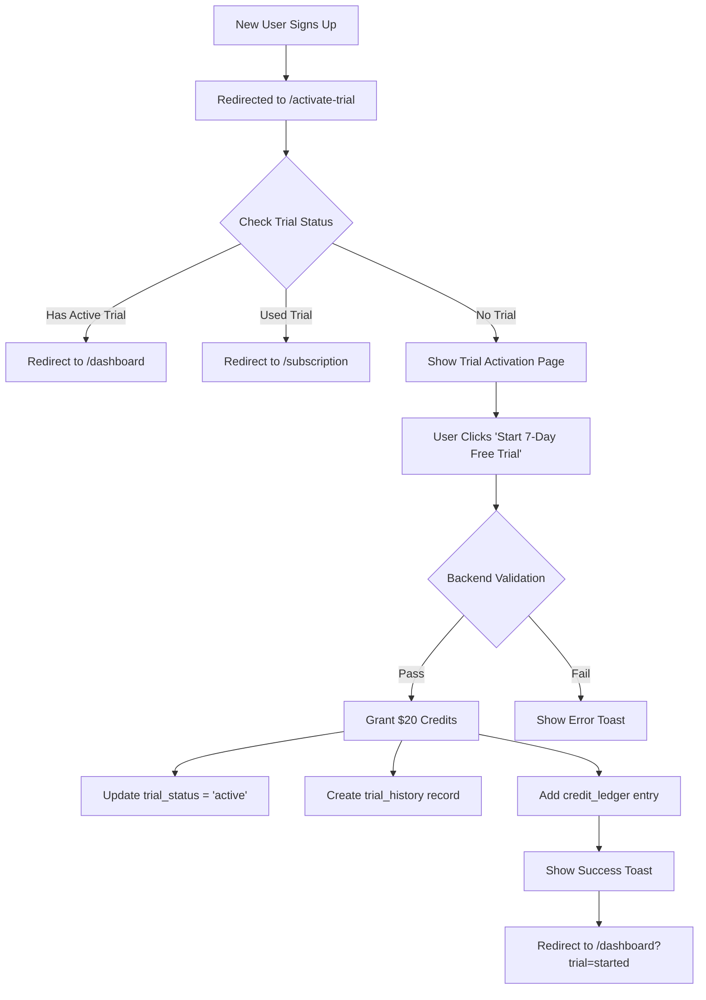

# Trial Activation Flow Analysis

## Overview
This document provides a comprehensive analysis of the trial activation flow in the Xera application, including the frontend UI, backend API, and data flow.

---

## 1. Entry Points

### `/activate-trial` Page
**File:** `frontend/src/app/activate-trial/page.tsx`

**Purpose:** Landing page for new users to start their 7-day free trial

**Key Features:**
- ✅ No payment required
- ✅ $20 in credits
- ✅ 7-day duration
- ✅ Instant activation
- ✅ Auto-redirect logic based on trial/subscription status

---

## 2. Frontend Flow

### A. Page Load Checks

```typescript
useEffect(() => {
  if (!isLoadingSubscription && !isLoadingTrial && subscription && trialStatus) {
    const hasActiveTrial = trialStatus.has_trial && trialStatus.trial_status === 'active';
    const hasUsedTrial = trialStatus.trial_status === 'used' || 
                         trialStatus.trial_status === 'expired' || 
                         trialStatus.trial_status === 'cancelled' ||
                         trialStatus.trial_status === 'converted';
    const hasActiveSubscription = subscription.tier && 
                                 subscription.tier.name !== 'none' && 
                                 subscription.tier.name !== 'free';
    
    // Auto-redirect logic
    if (hasActiveTrial || hasActiveSubscription) {
      router.push('/dashboard');  // Already has active trial or subscription
    } else if (hasUsedTrial) {
      router.push('/subscription');  // Trial already used, show subscription options
    }
  }
}, [subscription, trialStatus, isLoadingSubscription, isLoadingTrial, router]);
```

**Redirect Logic:**
1. **Active Trial/Subscription** → `/dashboard`
2. **Used Trial** → `/subscription`
3. **No Trial** → Stay on `/activate-trial`

### B. Trial Activation Handler

```typescript
const handleStartTrial = async () => {
  try {
    const result = await startTrialMutation.mutateAsync();
    // No Stripe redirect - instant activation
    router.push('/dashboard?trial=started');
  } catch (error: any) {
    console.error('Failed to start trial:', error);
    // Error handled by hook's onError
  }
};
```

### C. Data Hooks Used

1. **`useSubscription(!!user)`** - Gets subscription info
   - Returns: `SubscriptionInfo` with `tier.credits`
   - Endpoint: `GET /api/billing/subscription`

2. **`useTrialStatus(!!user)`** - Gets trial status
   - Returns: `TrialStatus` object
   - Endpoint: `GET /api/billing/trial/status`

3. **`useStartTrialWithoutPayment()`** - Activates trial
   - Mutation for: `POST /api/billing/trial/start-without-payment`
   - Returns: `{ success, message, credits_granted, trial_ends_at, tier }`

---

## 3. Backend API Endpoints

### A. Trial Status Check
**Endpoint:** `GET /api/billing/trial/status`

**Handler:** `backend/core/billing/api.py:842`

**Service:** `trial_service.get_trial_status(account_id)`

**Returns:**
```typescript
{
  has_trial: boolean;
  trial_status: 'none' | 'active' | 'expired' | 'converted' | 'cancelled' | 'used';
  trial_started_at?: string;
  trial_ends_at?: string;
  trial_mode?: string;
  remaining_days?: number;
  credits_remaining?: number;
  tier?: string;
  can_start_trial?: boolean;
  message?: string;
}
```

### B. Trial Activation (No Payment)
**Endpoint:** `POST /api/billing/trial/start-without-payment`

**Handler:** `backend/core/billing/api.py:939`

**Service:** `trial_service.start_trial_without_payment(account_id)`

**Security Checks:**
1. ✅ Trials enabled globally (`TRIAL_ENABLED`)
2. ✅ No trial history in `trial_history` table
3. ✅ No active `trial_status` in `credit_accounts`
4. ✅ No trial-related entries in `credit_ledger`

**Actions Performed:**
```python
# 1. Calculate trial end date
trial_ends_at = now + timedelta(days=7)  # TRIAL_DURATION_DAYS

# 2. Update credit_accounts
UPDATE credit_accounts SET
  trial_status = 'active',
  tier = 'tier_2_20',  # TRIAL_TIER
  trial_ends_at = trial_ends_at,
  balance = balance + 20.00  # TRIAL_CREDITS
WHERE account_id = account_id

# 3. Add credit ledger entry
credit_manager.add_credits(
  account_id=account_id,
  amount=20.00,
  description='7-day trial credits (no payment required)',
  type='trial_grant'
)

# 4. Create trial history
INSERT INTO trial_history (account_id, started_at, converted_to_paid, note)
VALUES (account_id, now, false, 'Trial started without payment details')
```

**Returns:**
```json
{
  "success": true,
  "message": "7-day trial started successfully",
  "credits_granted": 20.00,
  "trial_ends_at": "2025-10-10T13:25:15.087517+00:00",
  "tier": "tier_2_20"
}
```

### C. Subscription Info
**Endpoint:** `GET /api/billing/subscription`

**Handler:** `backend/core/billing/api.py:346`

**Service:** `subscription_service.get_subscription(account_id)`

**Returns:**
```json
{
  "status": "trialing",
  "plan_name": "tier_2_20",
  "display_plan_name": "Starter (Trial)",
  "price_id": "price_1S6M51K1vBaPZ9xHerPEa3p8",
  "subscription": {
    "id": null,
    "status": "trialing",
    "is_trial": true,
    "trial_ends_at": "2025-10-10T13:25:15.087517+00:00"
  },
  "tier": {
    "name": "tier_2_20",
    "credits": 25.0,
    "display_name": "Starter"
  },
  "is_trial": true,
  "trial_status": "active",
  "credits": {
    "balance": 10.0,
    "tier_credits": 25.0,
    "lifetime_granted": 5.0,
    "lifetime_used": 0.0
  }
}
```

---

## 4. Database Schema

### Tables Involved

#### `credit_accounts`
```sql
CREATE TABLE credit_accounts (
  account_id UUID PRIMARY KEY,
  balance DECIMAL DEFAULT 0.00,
  tier VARCHAR,
  trial_status VARCHAR,  -- 'none', 'active', 'expired', 'cancelled', 'converted'
  trial_ends_at TIMESTAMPTZ,
  stripe_subscription_id VARCHAR,
  last_grant_date TIMESTAMPTZ
);
```

#### `trial_history`
```sql
CREATE TABLE trial_history (
  id UUID PRIMARY KEY,
  account_id UUID REFERENCES auth.users(id),
  started_at TIMESTAMPTZ NOT NULL,
  ended_at TIMESTAMPTZ,
  converted_to_paid BOOLEAN DEFAULT false,
  note TEXT
);
```

#### `credit_ledger`
```sql
CREATE TABLE credit_ledger (
  id UUID PRIMARY KEY,
  account_id UUID,
  amount DECIMAL,
  balance_after DECIMAL,
  type VARCHAR,  -- 'trial_grant', 'usage', 'purchase', etc.
  description TEXT,
  created_at TIMESTAMPTZ DEFAULT NOW()
);
```

---

## 5. Configuration Constants

**File:** `backend/core/billing/trial_service.py`

```python
TRIAL_ENABLED = True  # Global trial feature flag
TRIAL_DURATION_DAYS = 7  # Trial length
TRIAL_CREDITS = 20.00  # Initial credits granted
TRIAL_TIER = "tier_2_20"  # Tier assigned during trial
```

---

## 6. React Query Cache Management

### Invalidations on Trial Start

```typescript
onSuccess: (data) => {
  queryClient.invalidateQueries({ queryKey: ['trial-status'] });
  queryClient.invalidateQueries({ queryKey: ['billing-status'] });
  queryClient.invalidateQueries({ queryKey: ['credit-balance'] });
  queryClient.invalidateQueries({ queryKey: ['billing', 'subscription'] });
  toast.success(`Trial started! You received $${data.credits_granted} in credits`);
}
```

This ensures all billing-related data is refreshed after trial activation.

---

## 7. Security Features

### One Trial Per Account - Multi-Layer Enforcement

1. **Trial History Table** - Permanent record
   ```sql
   SELECT * FROM trial_history WHERE account_id = $1
   ```

2. **Trial Status Field** - Current state
   ```sql
   SELECT trial_status FROM credit_accounts WHERE account_id = $1
   ```

3. **Credit Ledger Audit** - Transaction history
   ```sql
   SELECT * FROM credit_ledger 
   WHERE account_id = $1 
   AND (description ILIKE '%trial%' OR type = 'trial_grant')
   ```

### Error Responses

**Already Used Trial:**
```json
{
  "status_code": 403,
  "detail": "This account has already used its trial. Each account is limited to one free trial."
}
```

**Trials Disabled:**
```json
{
  "status_code": 400,
  "detail": "Trials are not currently enabled"
}
```

---

## 8. User Experience Flow



---

## 9. Frontend Type Definitions

### SubscriptionInfo (Expected from `/api/billing/subscription`)

```typescript
interface SubscriptionInfo {
  status: string;
  plan_name: string;
  price_id: string;
  subscription: {
    id: string;
    status: string;
    price_id: string;
    current_period_end: string;
    cancel_at?: string;
  } | null;
  tier: {
    name: string;
    credits: number;
  };
  credits: {
    balance: number;
    tier_credits: number;
    lifetime_granted: number;
    lifetime_purchased: number;
    lifetime_used: number;
    can_purchase_credits: boolean;
  };
  is_trial?: boolean;
  trial_status?: string;
  trial_ends_at?: string;
}
```

### TrialStatus (Expected from `/api/billing/trial/status`)

```typescript
interface TrialStatus {
  has_trial: boolean;
  trial_status?: 'none' | 'active' | 'expired' | 'converted' | 'cancelled' | 'used';
  trial_started_at?: string;
  trial_ends_at?: string;
  trial_mode?: string;
  remaining_days?: number;
  credits_remaining?: number;
  tier?: string;
  can_start_trial?: boolean;
  message?: string;
  trial_history?: {
    started_at?: string;
    ended_at?: string;
    converted_to_paid?: boolean;
  };
}
```

---

## 10. Current Issues & Fixes

### Issue 1: Production vs Local API Response Mismatch

**Problem:**
- Production backend (xera.cc) returns OLD format without `tier` object
- Local backend returns NEW format with `tier: { name, credits }`
- Frontend expects NEW format

**Fix Applied:**
Changed `subscription.tier.credits` to `subscription.tier?.credits || 0` in:
- `frontend/src/contexts/SubscriptionContext.tsx` (lines 110, 132)

**Status:** ✅ Fixed with optional chaining

### Issue 2: Frontend Pointing to Production API

**Problem:**
Frontend `.env` had `NEXT_PUBLIC_BACKEND_URL=https://xera.cc/api`

**Fix:**
User manually updated to `NEXT_PUBLIC_BACKEND_URL=http://localhost:8000/api`

**Status:** ✅ Fixed by user

---

## 11. Testing Checklist

### Local Testing

- [ ] User with no trial can access `/activate-trial`
- [ ] User with active trial is redirected to `/dashboard`
- [ ] User who used trial is redirected to `/subscription`
- [ ] Trial activation grants $20 credits
- [ ] Trial activation creates `trial_history` record
- [ ] Second trial attempt is blocked (403 error)
- [ ] Trial end date is 7 days from activation
- [ ] Credits are usable in AI chat
- [ ] Subscription endpoint returns `tier` object
- [ ] Trial status endpoint returns correct state

### Production Deployment

- [ ] Backend code deployed with `tier` object in response
- [ ] Trial endpoint available: `/api/billing/trial/start-without-payment`
- [ ] Trial status endpoint available: `/api/billing/trial/status`
- [ ] Database migrations applied
- [ ] Environment variables set (TRIAL_ENABLED, TRIAL_CREDITS, etc.)

---

## 12. Key Files Reference

### Frontend
- `frontend/src/app/activate-trial/page.tsx` - Trial activation UI
- `frontend/src/hooks/react-query/billing/use-trial-status.ts` - Trial hooks
- `frontend/src/lib/api/billing-v2.ts` - API client functions
- `frontend/src/contexts/SubscriptionContext.tsx` - Subscription state management

### Backend
- `backend/core/billing/api.py` - API routes (lines 842, 939, 346)
- `backend/core/billing/trial_service.py` - Trial business logic (line 139)
- `backend/core/billing/credit_manager.py` - Credit operations
- `backend/core/billing/subscription_service.py` - Subscription logic

### Database
- `backend/supabase/migrations/` - Schema migrations
- Tables: `credit_accounts`, `trial_history`, `credit_ledger`

---

## 13. Summary

The trial activation flow is **working correctly in local development** with the following features:

✅ **No payment required** - Instant activation  
✅ **$20 credits granted** - Via `credit_manager.add_credits()`  
✅ **7-day duration** - Configurable via `TRIAL_DURATION_DAYS`  
✅ **One per account** - Multi-layer enforcement  
✅ **Auto-redirect logic** - Based on trial/subscription status  
✅ **Type-safe** - Full TypeScript types for API responses  
✅ **Cache management** - React Query invalidations on success  

**Production deployment pending** - Backend changes need to be deployed to xera.cc to match the new API structure with `tier` object.
